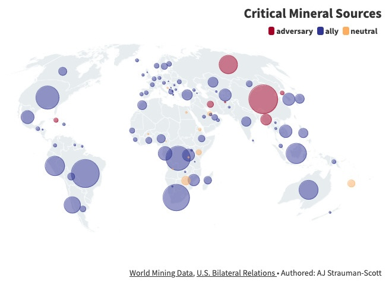

```{r setup, include=FALSE}
knitr::opts_chunk$set(echo = TRUE)

# Packages
library(tidyverse)

# Read RDS
minerals <- readRDS('data/rds/minerals.rds')
stability <- readRDS('data/rds/stability.rds')
relationships <- readRDS('data/rds/relationships.rds')
```

## Introduction

In 2022, the U.S geological survey posted the 'final list of critical minerals'$^1$. This list outlines the fifty minerals most essential to the global economy and security.

Most key technologies  are mineral-intensive. An electric vehicle (EV), for example, requires twice as much copper and manganese as an internal combustion engine vehicle, and also needs lithium, nickel, cobalt, and graphite for its batteries$^2$. Similarly, clean energy technologies such as wind turbines and solar PV, as well as the electricity grids needed to transmit their power, require more minerals per unit installed capacity than fossil fuel counterparts—up to 2 to 7 times$^2$.

For years, the United States' mineral import dependence grew. As technology has taken over, minerals are the foundation of the country, and even the world's economic and national security. According to the U.S. Geologic Survey$^3$, Russia is the source of six major minerals for which the U.S. is more than 50 percent import-dependent. Ukraine is the source of two major mineral imports: titanium, for which the U.S. is more than 90 percent import-dependent, and gallium ,for which the U.S. is 100 percent import-dependent.

Whether it was the Ever Given, a cargo ship blocking the Suez Canal, the Covid pandemic, or tariffs on Chinese steel, the last decade has demonstrated geopolitical tensions and global events can drastically impact interconnected sectors of our economy$^10$. The world economy will continue to remain vulnerable unless serious and practical steps are taken to fortify mineral supply chains, which for years have been built using imported materials.

This paper explores the political relationships between the United States and the countries with whom the nation is most dependent upon for critical minerals, with the intention to create a visualization to best communicate the current geopolitical situation as it relates to mineral mining, production and export.

## Data Sources

The sources for the countries that produce and export each mineral on the 2022 List of Critical Minerals.

#### Mineral Exporting Countries

-   Top producers worldwide for thirty seven of the 50 minerals came from the U.S. Geological Survey Mineral Commodity Summaries $^3$

-   Data on the top exporters of zinc and indium came from the World Mining Data website$^4$

-   Montana Bureau of Mines and Geology$^5$ provided data on the global sources of ytterbium, holmium and lutetium.

-   The Minor Metals Trade Association$^6$ provided the global producers and exporters of erbium, praseodymium, gadolinium, europium, sararium, terbium and thulium.

-   Data on dysprosium exporters came from Asian Metal$^7$

```{r allies-vs-adversaries, echo=FALSE}
relationships |> 
  group_by(relationship) |> 
  summarise(count = n()) |> 
  knitr::kable(caption = "US Allies and Adversaries") |> 
  kableExtra::kable_styling(
                            full_width = FALSE,
                            position = "float_right")
```


<br>


#### International Politics

The 50 critical minerals and their source countries were combined with a categorization of each country's international relationship with the US.

Countries were categorized as an 'ally', 'adversary' or 'neutral' based on U.S. Bilateral Relations Fact Sheets$^8$ provided by the US Department of State. This paper made judgments on how to categorize each relationship based on descriptions in the overall description and 'Bilateral Economic Relations' section.

<br>
<br> 


## Analysis

The United States has active ally relationships with most of the countries that export critical minerals - excellent news! But those 7 adversarial relationships could be disastrous, or just inconvenient. It all depends on what minerals those countries export, and how much of the world's share they are responsible for.

```{r china-russia-shares, echo=FALSE}

# Filter and summarize data for China
china <- minerals |>
  filter(country == "China", !is.na(share), share > 1) |>
  arrange(desc(share)) |>
  reframe(
    mineral = mineral,
    share = round(share, 1)
  )

# Filter and summarize data for Russia
russia <- minerals |>
  filter(country == "Russia", !is.na(share), share > 3) |>
  arrange(desc(share)) |>
  reframe(
    mineral = mineral,
    share = round(share, 1)
  ) 


# Filter and summarize data for North Korea
korea <- minerals |>
  filter(country == "North Korea", !is.na(share)) |>
  arrange(desc(share)) |>
  reframe(
    mineral = mineral,
    share = round(share, 1)
  ) 

# Filter and summarize data for Iran
iran <- minerals |>
  filter(country == "Iran", !is.na(share), share > 1) |>
  arrange(desc(share)) |>
  reframe(
    mineral = mineral,
    share = round(share, 1)
  ) 

# Filter and summarize data for Myanmar
myanmar <- minerals |>
  filter(country == "Myanmar", !is.na(share), share > 1) |>
  arrange(desc(share)) |>
  reframe(
    mineral = mineral,
    share = round(share, 1)
  ) 

# Display each table separately
china |> 
  knitr::kable(caption = "CHINA") |> 
  kableExtra::kable_styling(full_width = FALSE, position = "float_left")

russia |> 
  knitr::kable(caption = "RUSSIA") |> 
  kableExtra::kable_styling(full_width = FALSE, position = "float_left")

korea |> 
  knitr::kable(caption = "NORTH KOREA") |> 
  kableExtra::kable_styling(full_width = FALSE, position = "float_left")

iran |> 
  knitr::kable(caption = "IRAN") |> 
  kableExtra::kable_styling(full_width = FALSE, position = "float_left")

myanmar |> 
  knitr::kable(caption = "MYANMAR") |> 
  kableExtra::kable_styling(full_width = FALSE, position = "float_left")

```

<br> <br> <br> <br> <br> <br> <br> <br> <br> <br> <br> <br> <br>

Iran, Myanmar, and North Korea do not export many critical minerals, and those they do export are only in amounts that make up a single digit percent share of global production.

The importance of maintaining diplomatic relationships with China and Russia is the largest political issue facing critical mineral sourcing today. China produces greater than 35% of thirteen different critical minerals and Russia produces 40% of the world's palladium.

<br> <br> <br> <br> <br> <br> <br> <br> <br> <br> <br> <br> <br> <br> <br> <br> <br> <br> <br> <br> <br> <br> <br>

```{r minerals-with-unstable-sources, echo=FALSE}
#| tab.cap = "Percent Source \'Unstable\'"
test_table <- stability |> 
  filter(stability == "Unstable") |> 
  arrange(desc(percent)) |>
  reframe(
    mineral = mineral,
    percent = percent) 


# Split the dataframe into three parts
n <- nrow(test_table)
n_per_table <- ceiling(n / 3)

table1 <- test_table |> slice(1:n_per_table)
table2 <- test_table |> slice((n_per_table + 1):(2 * n_per_table))
table3 <- test_table |> slice(((2 * n_per_table) + 1):n)

# Display each table separately
table3 |> 
  knitr::kable() |> 
  kableExtra::kable_styling(full_width = FALSE, position = "float_right")

table2 |> 
  knitr::kable() |> 
  kableExtra::kable_styling(full_width = FALSE, position = "float_right")

table1 |> 
  knitr::kable() |> 
  kableExtra::kable_styling(full_width = FALSE, position = "float_right")

```

<br> <br> <br> <br> <br> <br> <br> Political relationships are not the only issue in critical mineral sourcing. War, pandemic and natural disasters can also make mineral sources unstable. World Mining Data$^4$ categorized the sources of each critical mineral as 'Stable', 'Fair', 'Unstable' and 'Extremely Unstable' based on the full circumstances - political, economic, social, natural - that help or hinder the production or mining of that mineral.

Twenty two of fifty critical minerals have more than 35% of their sources categorized as 'Unstable' or 'Extreme Unstable'. <br> <br> <br> <br>

## Visualization

[The best way to display this story is interactively](https://public.flourish.studio/visualisation/17913685/). Using an online application called Flourish$^9$, the data collected from the sources above was mapped onto a globe projection. Each country was assigned a color based on its political relationship with the US, and a circle corresponding the number of critical minerals the country exports. Clicking on any of the circles activates a pop-up information card, that lists the  mineral that the country has the largest global production share in. 

[{width="600"}](https://public.flourish.studio/visualisation/17913685/)


## Conclusion

The dependency of the United States on imports for key critical minerals, particularly from countries like Russia and China, raises concerns about vulnerability to geopolitical tensions and disruptions. With geopolitical tensions on the rise and global events becoming increasingly unpredictable, it is imperative to take proactive measures to strengthen mineral supply chains. Modern industry's reliance on critical minerals underscores the necessity of ensuring stable and secure supply chains. Disruptions in the mineral supply chain can have far-reaching consequences, affecting not only economic stability but also national security. 

The analysis and visualization of this data emphasize the need for policymakers, industry leaders, and stakeholders to prioritize the development of resilient and sustainable mineral supply chains. By addressing this issue proactively, the United States can build a more secure and stable foundation for the global economy and pave the way for sustainable growth and prosperity in the years to come.

### References

1.  U.S. Geological Survey, Department of the Interior. (2022, February 24). *2022 Final List of Critical Minerals*. Federal Register. <https://www.federalregister.gov/documents/2022/02/24/2022-04027/2022-final-list-of-critical-minerals>

2.  IEA. 2021. *The Role of Critical Minerals in Clean Energy Transitions*. International Energy Agency, 2021. <https://iea.blob.core.windows.net/assets/ffd2a83b-8c30-4e9d-980a-52b6d9a86fdc/TheRoleofCriticalMineralsinCleanEnergyTransitions.pdf>.

3.  National Minerals Information Center. 2024. *U.S. Geological Survey Mineral Commodity Summaries 2024*. Data Release: U.S. Geological Survey data release, <https://doi.org/10.5066/P144BA54>.

4.  World Mining Data. (n.d.). *World Mining Data*. Retrieved from <https://www.world-mining-data.info/?World_Mining_Data>

5.  Montana Bureau of Mines and Geology. (2010). *Montana Yttrium and Rare Earth Oxide Deposits [Fact Sheet]*. *Critical Mineral: Lutetium [Facts Sheet]*. Montana Tech, University of Montana. Retrieved from <https://www.mbmg.mtech.edu/pdf-publications/fs10.pdf>

6.  The Minor Metals Trade Association. (n.d.). *Samarium*. *Terbium.* *Thulium.* Retrieved from <https://mmta.co.uk/metals/>

7.  Asian Metal. (n.d.). *Dysprosium Import-Export Data*. Retrieved from <https://www.asianmetal.com/Dysprosium-Import-Export-Data/>

8.  U.S. Department of State. (n.d.). *U.S. Bilateral Relations Fact Sheets*. Retrieved from <https://www.state.gov/u-s-bilateral-relations-fact-sheets/>

9.  *Flourish*. (n.d.). Retrieved from <https://flourish.studio>

10. Minerals Make Life. (2022, March 30). *The ripple effect of world events on mineral supply chains* [Blog post]. Retrieved from https://mineralsmakelife.org/blog/the-ripple-effect-of-world-events-on-mineral-supply-chains/
